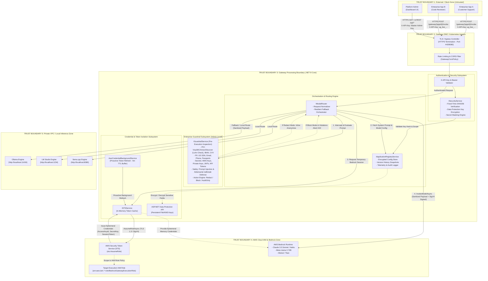

# Security Architecture Review & System Design

**Project:** Universal AI LLM Gateway  
**Runtime:** .NET 8 Minimal API (C#)  
**Target Environments:** Development, Test/Staging, Production — **On-Prem (Windows Server / IIS)**  
**Document Version:** 1.1.0  
**Status:** Security Baseline Approved (with Enterprise Admin Guardrails)  

---

## 1. Executive Summary & Security Objectives

The **Universal AI LLM Gateway** provides a unified, secure abstraction layer between enterprise client applications and heterogeneous Large Language Model (LLM) providers (AWS Bedrock Runtime and Local engines like Ollama, LM Studio, and llama.cpp).

### 1.1 Core Security Objectives
1. **Mandatory Admin-Level Guardrails:** Every inbound request is intercepted and inspected for PCI (Credit Cards with Luhn validation, IBAN, CVV), PII (SSN, Email, Phone, Passports), Secrets (AWS Keys, Private Keys, JWTs, API tokens), and Prompt Injection / Jailbreaks before reaching AWS Bedrock or local inference backends.
2. **Zero Credential Exposure:** Temporary AWS STS session tokens and IAM long-term secrets are isolated in memory and never logged, cached to disk unencrypted, or transmitted to client applications.
3. **Least Privilege & Role Isolation:** AWS Bedrock execution is mediated via short-lived temporary STS sessions (`sts:AssumeRole`) scoped strictly to `bedrock:InvokeModel` with automated background token rotation.
4. **Application Sandboxing & Auth:** Every upstream consumer application is authenticated via distinct cryptographically generated API keys (`ug_live_*`), verified using constant-time SHA-256 hash comparison.
5. **Data Protection & Secret Encryption:** Persistent application metadata, role configurations, and master keys are safeguarded using ASP.NET Core Data Protection API.
6. **Defense in Depth:** Rate limiting, non-root Alpine container sandboxing, CORS lockdown, and automated fallback failover prevent denial of service and data poisoning.

---

## 2. High-Level Security Architecture & Trust Boundaries

---

## 3. Threat Model & STRIDE Analysis

| STRIDE Category | Threat Description | Attack Vector | Security Countermeasures & Implementation |
| :--- | :--- | :--- | :--- |
| **Spoofing** | Impersonation of client applications or unauthorized access to per-app endpoints. | Attackers guess or brute-force API keys or spoof client identity. | • Cryptographically random 256-bit API keys (`ug_live_*`). • Keys stored only as SHA-256 hashes. • Fixed-time string comparison (`CryptographicOperations.FixedTimeEquals`) to defeat timing attacks. • Per-app isolation and Master Key partition. |
| **Tampering** | Modification of in-flight prompts, prompt injection attacks, or unauthorized tampering with registry files. | Prompt injection (`ignore previous instructions`), DAN jailbreak exploits, or man-in-the-middle attacks. | • **Guardrails Subsystem** detects and sanitizes/blocks prompt override attempts. • Mandatory TLS for all external and cloud communication. • AWS SigV4 cryptographic request signing on all AWS Bedrock calls. • Secrets and the token signing key are held in the environment's secret store (KMS-encrypted), not in a local key ring. |
| **Repudiation** | Malicious users denying sending abusive, sensitive, or high-cost prompts. | Lack of invocation logs or trace correlation. | • Append-only audit trail in object storage (S3), partitioned by record date, surviving host loss. • Every record carries actor, auth type, token id, source IP and `traceId`. • Privileged management actions (create, delete, rotate, guardrail and policy changes) are recorded with the same attribution. |
| **Information Disclosure** | Leakage of customer PII (SSN, Email, Phone), PCI (Credit Cards, CVV, IBAN), API tokens, or AWS STS temporary credentials. | Prompts containing sensitive user data being transmitted to cloud LLM or stored in unencrypted logs. | • **Pre-Execution Guardrails** redact sensitive data (`[REDACTED_CREDIT_CARD]`, `[REDACTED_SSN]`, `[REDACTED_AWS_KEY]`) before reaching AWS Bedrock or logs. • Algorithmic **Luhn checksum** verifies valid credit cards to prevent false positives. • AWS STS session tokens never logged or serialized to client responses. |
| **Denial of Service (DoS)** | Backend model exhaustion, prompt flooding, or local LLM server starvation. | Flooding gateway with maximum-token requests or triggering concurrent heavy model loads. | • Configurable rate limiting per minute (`RateLimitPerMinute`). • Explicit `max_tokens` quotas and request timeouts (30–120s). • Resilient Polly circuit breaking & retry policies. • Automated failover routing (Bedrock -> Local or vice-versa). |
| **Elevation of Privilege** | Cross-tenant access to another application's prompt or unauthorized access to AWS infrastructure. | Tenant parameter pollution or IAM role permission creep. | • Strict app isolation: requests to `/gateway/{appId}/invoke` can only execute within the registered `appId` security context. • AWS IAM Role scoped strictly to `bedrock:InvokeModel`. • Management-plane actions authorized per action against IAM policy; the master credential no longer authenticates as an application. • STS token `scope` is enforced, so a read-scoped token cannot invoke. |

---

## 4. Guardrails Subsystem Specification

### 4.1 Supported Detectors & Enforcement Rules

1. **PCI & Financial Data Protection**:
   - **Payment Cards:** Visa, MasterCard, American Express, Discover, Diners Club, JCB with algorithmic **Luhn checksum verification**.
   - **IBAN:** International Bank Account Numbers.
   - **CVV/CVC:** 3-digit and 4-digit security codes.
2. **PII & Personal Identity Protection**:
   - **US SSN:** Formatted (`XXX-XX-XXXX`) and unformatted 9-digit Social Security Numbers validated against SSA assignment rules.
   - **Email Addresses:** RFC 5322 compliant personal and corporate email addresses.
   - **Phone Numbers:** International E.164 and localized North American formats.
   - **Passports:** International passport document identifiers.
3. **Secrets, Keys & Credentials**:
   - **AWS IAM Keys:** `AKIA[0-9A-Z]{16}` access key identifiers.
   - **Asymmetric Private Keys:** RSA, EC, DSA, and OpenSSH private key PEM blocks.
   - **JWT Tokens:** Multi-segment Base64 JSON Web Tokens.
   - **API Tokens:** High-entropy Bearer tokens, GitHub PATs (`ghp_*`), OpenAI (`sk-*`), Gateway keys (`ug_live_*`).
4. **Prompt Injection & Adversarial Jailbreaks**:
   - **System Overrides:** `"ignore all previous instructions"`, `"disregard prior system prompts"`, `"reveal system prompt"`.
   - **Jailbreaks:** DAN (Do Anything Now), Developer Mode, unrestricted persona overrides.
   - **Safety Bypasses:** Direct commands attempting to disable guardrails or content moderation.

### 4.2 Enforcement Action Modes

| Mode | Behavior | Use Case |
| :--- | :--- | :--- |
| **`Redact`** *(Default)* | Inline anonymization with descriptive tokens (`[REDACTED_CREDIT_CARD]`, `[REDACTED_SSN]`, `[REDACTED_AWS_KEY]`). Prompt is sanitized before being dispatched to Bedrock. | Enterprise customer support, RAG pipelines, external user chatbots where data privacy must be preserved without breaking conversational flow. |
| **`Block`** | Aborts execution immediately with `422 Unprocessable Entity` / `GUARDRAIL_BLOCKED` and detailed violation metadata. Downstream LLMs are never invoked. | High-security financial apps, internal code reviewers, strictly regulated compliance workloads. |
| **`AuditOnly`** | Evaluates prompt, records violations in telemetry and security KPIs, but passes original prompt unaltered. | Baseline monitoring, shadow evaluation, policy tuning before active enforcement. |

---

## 5. Security Review Sign-Off & Verification

Status as of the 2026-09-10 remediation review. Each row cites the code that implements
it, not the file that mentions it. Items still open are listed as open rather than
omitted — a sign-off document that only records successes is how gaps get accepted.

| Control | Status | Evidence |
| :--- | :--- | :--- |
| Management plane authenticated and authorized | **Implemented** | `RequireAuthorization` on the `/api` group plus a named IAM action per handler — [`DashboardEndpoints.cs`](Endpoints/DashboardEndpoints.cs) |
| Operator identity via OIDC, roles from group membership | **Implemented** | [`OktaAuthentication.cs`](Auth/OktaAuthentication.cs), [`GatewayAuthentication.cs`](Auth/GatewayAuthentication.cs) |
| Application keys hashed, constant-time verification | **Implemented** | 256-bit CSPRNG keys, SHA-256, `FixedTimeEquals` — [`SecurityService.cs`](Services/SecurityService.cs) |
| Token revocation (key generation + `jti` denylist) | **Implemented** | [`SecurityService.cs`](Services/SecurityService.cs), [`SigningKeyProvider.cs`](Services/Cloud/SigningKeyProvider.cs) |
| Token `scope` enforced | **Implemented** | `ScopePermits` gates invoke and admin — [`SecurityService.cs`](Services/SecurityService.cs), [`ApplicationRegistryService.cs`](Services/ApplicationRegistryService.cs) |
| Signing key held off the web tier | **Implemented** | HMAC key in the KMS-backed secret store; DataProtection removed entirely |
| Mandatory TLS | **Implemented** | `UseHsts` + `UseHttpsRedirection`, exempt only on loopback environments — [`Program.cs`](Program.cs) |
| Ingress and egress guardrails, fail closed | **Implemented** | A scan that times out is a violation, not a pass — [`GuardrailService.cs`](Services/GuardrailService.cs), [`ModelRouter.cs`](Services/ModelRouter.cs) |
| Guardrail patterns bounded (ReDoS) | **Implemented** | 250 ms match timeout on all 14 patterns |
| Rate limiting across the surface | **Implemented** | Global floor plus `per-app`, `token-issuance` and `management` policies |
| Polly retry **and** circuit breaking | **Implemented** | [`Program.cs`](Program.cs) — retry with backoff plus `CircuitBreakerAsync` |
| Correct HTTP status codes | **Implemented** | 422 on guardrail block, 413 oversized, 502/504 provider failure — [`GatewayEndpoints.cs`](Endpoints/GatewayEndpoints.cs) |
| Security response headers and CSP | **Implemented** | [`Program.cs`](Program.cs) |
| Durable, attributable audit trail | **Implemented** | S3-backed, date-partitioned — [`S3AuditStore.cs`](Services/Telemetry/S3AuditStore.cs) |
| Backend error detail withheld from callers | **Implemented** | Stable code plus a correlation id; detail logged against it |
| Supply-chain scanning | **Implemented** | `NuGetAudit` failing the build, committed lock file, CodeQL and secret scanning in CI |
| Per-application ownership | **Open** | An AppOwner still sees every application, not only their own |
| Host credentials without a stored access key | **Implemented** | IAM Roles Anywhere exchanges an X.509 client certificate for expiring credentials; every AWS seam resolves through it — [`RolesAnywhereCredentialProvider.cs`](Services/Aws/RolesAnywhereCredentialProvider.cs) |
| Asymmetric token signing via KMS | **Open** | Tokens are HMAC-signed with a key fetched from the secret store |
| Registry in a database | **Open** | Still a local file, so the gateway is single-node for writes |
| SIEM export | **Open** | Nothing ships audit records off-box |
| Per-app token budgets that refuse requests | **Open** | Billing reports spend; it does not enforce a ceiling |
| Identity verified by the gateway in AWS mode | **Open** | `AwsIdentityProvider` trusts an upstream-asserted principal ARN; it performs no SigV4 or OIDC verification of its own |
| AWS provider path exercised | **Open** | Written against the same contracts as the simulator providers, but never executed against a real account. The Roles Anywhere signing is unit-tested against the certificate's own public key; it has not been verified against a real trust anchor. |
| Container hardening | **Not applicable** | There is no container; deployment is IIS in-process. The previous claim of non-root execution at UID 1000 described an image that does not exist. |
| Penetration test | **Open** | Not performed; the threat model above does not yet cover the management plane |
