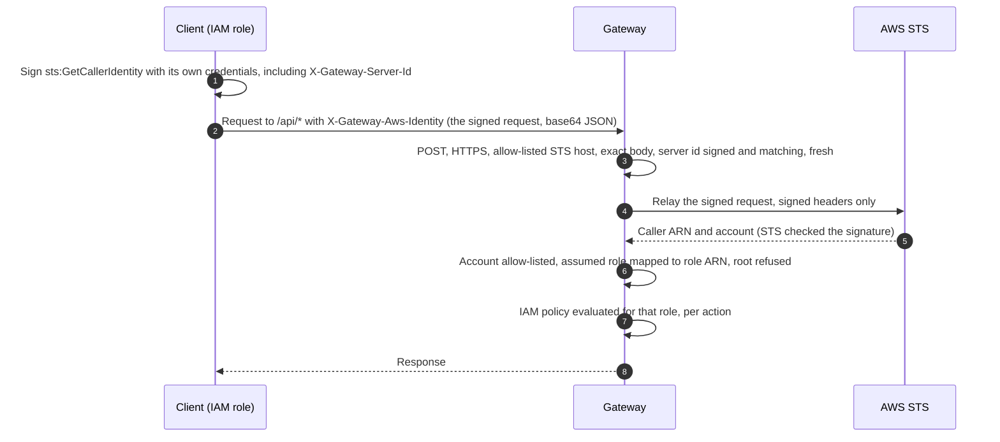

# AWS IAM Authentication for Automation

How a script, pipeline or service authenticates to the management plane (`/api/*`) in AWS mode using its own IAM identity — with no gateway secret to store and no AWS secret sent to the gateway.

People sign in through Okta. The break-glass key is for emergencies. Everything else that needs `/api` uses this.

> This replaces the earlier behaviour, in which the gateway accepted any `arn:aws:…` string as an identity (SL-01 in [`security-architecture-flow.md`](security-architecture-flow.md)). A bare ARN is now refused.

---

## How it works



- The client's secret key never leaves the client. The gateway sees a signature, which proves possession of the key for this one request.
- The signature covers `X-Gateway-Server-Id`, so a request signed for another service cannot be replayed here.
- The request is accepted for `MaxRequestAgeSeconds` (default 300) after its `X-Amz-Date`.
- The gateway relays only to an allow-listed STS host and only the exact `GetCallerIdentity` call, so it cannot be used as a relay for anything else.
- It works over HTTPS only. An API call over plain HTTP is refused with `403 HTTPS_REQUIRED` before any of this runs.

---

## Configure the gateway

```jsonc
"Gateway": {
  "Cloud": {
    "Provider": "Aws",
    "AwsIdentity": {
      "Enabled": true,
      "ServerId": "unified-gateway-prod",          // not a secret; must be signed by the caller
      "AllowedAccountIds": [ "111122223333" ],     // whose principals may authenticate
      "AllowedStsHosts": [],                       // empty = sts.amazonaws.com + sts.<region>.amazonaws.com
      "MaxRequestAgeSeconds": 300,
      "CacheSeconds": 60,
      "TimeoutSeconds": 10
    }
  }
}
```

The server refuses to start if `Enabled` is true with no `ServerId`, an empty or placeholder account list, a non-STS host, or a provider other than `Aws`.

Then grant the role what it needs in the access policy (`/gateway/<env>/access-policy`), exactly as for an Okta-mapped role:

```json
{
  "Effect": "Allow",
  "Principal": { "AWS": "arn:aws:iam::111122223333:role/GatewayAutomationRole" },
  "Action": [ "gateway:ListApplications", "gateway:RotateApiKey" ],
  "Resource": "*"
}
```

> STS reports an assumed role as `arn:aws:sts::ACCOUNT:assumed-role/ROLE/SESSION`; the gateway maps it to `arn:aws:iam::ACCOUNT:role/ROLE`. That ARN carries no IAM path, so write policy principals without one.

---

## Client example (Python)

```python
import base64
import json
import urllib.request

import boto3
from botocore.auth import SigV4Auth
from botocore.awsrequest import AWSRequest

GATEWAY = "https://gateway.enterprise.internal"
SERVER_ID = "unified-gateway-prod"       # Gateway:Cloud:AwsIdentity:ServerId
REGION = "us-east-1"

credentials = boto3.Session().get_credentials().get_frozen_credentials()

url = f"https://sts.{REGION}.amazonaws.com/"
body = "Action=GetCallerIdentity&Version=2011-06-15"
signed = AWSRequest(method="POST", url=url, data=body, headers={
    "Content-Type": "application/x-www-form-urlencoded; charset=utf-8",
    "X-Gateway-Server-Id": SERVER_ID,
})
SigV4Auth(credentials, "sts", REGION).add_auth(signed)   # signs every header present, server id included

envelope = {"method": "POST", "url": url, "body": body, "headers": dict(signed.headers.items())}
identity = base64.b64encode(json.dumps(envelope).encode()).decode()

request = urllib.request.Request(f"{GATEWAY}/api/apps", headers={"X-Gateway-Aws-Identity": identity})
print(urllib.request.urlopen(request).read().decode())
```

Reuse one signed header for a burst of calls within its validity window, then sign a fresh one.

---

## What is refused

Each of these gets a 401. All but the last three are refused before the gateway contacts AWS.

| Presented | Why |
| :--- | :--- |
| A bare ARN in `X-API-Key`, `Authorization` or `X-Simulator-Role` | An assertion, not a proof |
| A URL that is not `https://<allow-listed sts host>/` (other host, lookalike host, `http`, port, path, query) | The gateway relays to STS and nowhere else |
| A body other than exactly `Action=GetCallerIdentity&Version=2011-06-15` | Only the identity call is relayed |
| `X-Gateway-Server-Id` missing, wrong, or not in `SignedHeaders` | Not bound to this gateway |
| `X-Amz-Date` older than `MaxRequestAgeSeconds` or in the future | Stale or pre-dated |
| STS rejects the signature | STS is the verifier |
| An account outside `AllowedAccountIds` | Out of scope |
| Root, or a federated user | Only IAM roles and users may manage the gateway |

---

## Verification status

The gateway side is covered by `SecurityLoopTests` (SL-01 group) against a stub STS that records exactly what was relayed. It has not yet been exercised against a real AWS account — the same caveat as the rest of the AWS provider path. Run the Python example against a staging gateway before relying on it.
