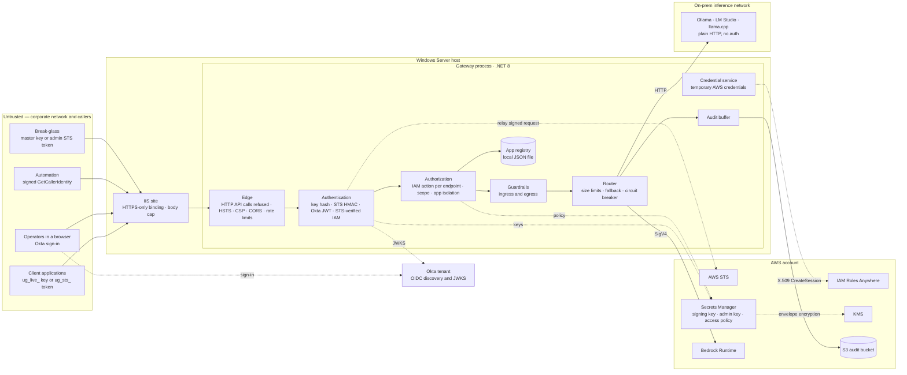
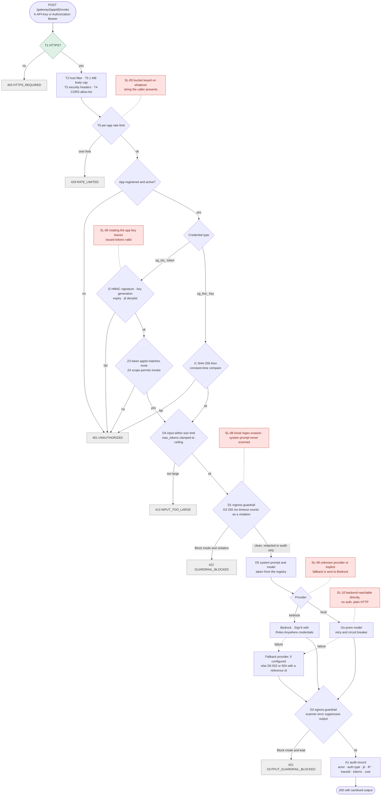
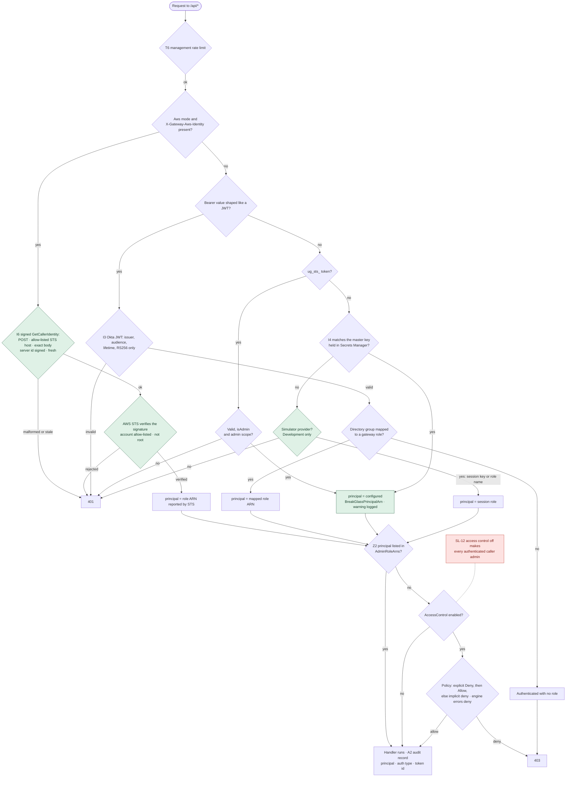
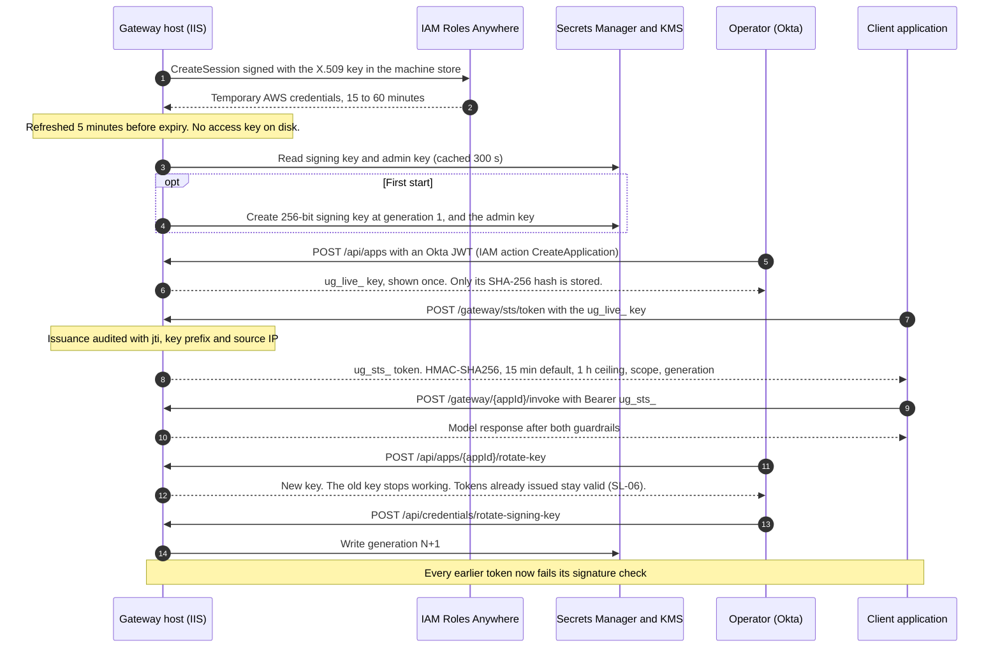
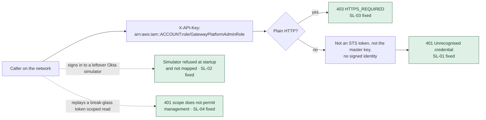

# Security Architecture & Control Flow — Unified LLM Gateway

Prepared for the security team: what the gateway protects, how a request moves through its controls, why each control exists, and where the design still leaks ("security loops").

> A styled version of this document is at [`security-architecture-flow.html`](security-architecture-flow.html).

| | |
| :--- | :--- |
| **Target** | `UnifiedGatewayV2` · branch `main` · reviewed at commit `57f9858` |
| **Remediation** | SL-01 to SL-04 fixed in the working tree (not yet committed) · 263 tests passing, up from 195 |
| **Date** | 2026-09-10 |
| **Method** | Static review of source, configuration and deployment scripts. Guardrail bypass inputs were run against the shipped regex patterns on the .NET regex engine. The fixes are covered by unit tests. Nothing was deployed or exploited. |
| **Deployment assumed** | Windows Server + IIS in-process, `ASPNETCORE_ENVIRONMENT=Production`, `Gateway:Cloud:Provider=Aws` |
| **Related** | [`architecture.md`](../architecture.md) · [`aws-iam-authentication.md`](aws-iam-authentication.md) · [`gateway-hardening-review.md`](gateway-hardening-review.md) · [`hardening-implementation.md`](hardening-implementation.md) |

---

## 1. Summary

The gateway sits between internal applications and large language models — AWS Bedrock in the cloud and Ollama / LM Studio / llama.cpp on-prem. It has two planes:

- **Data plane** (`/gateway/*`). Applications invoke models with an API key or a short-lived STS token. Every prompt and every response passes through a guardrail.
- **Management plane** (`/api/*`). Operators register applications, mint and rotate credentials, change guardrail policy and read billing. Every endpoint requires authentication plus a named IAM action.

The review found **17 security loops**. The four that let an outsider in are now fixed:

| ID | Was | Now |
| :--- | :--- | :--- |
| **SL-01** · Critical | In AWS mode, any string beginning `arn:aws:` was accepted as an authenticated identity, so sending the admin role's ARN granted full management access. | Automation proves its IAM identity with a SigV4-signed `sts:GetCallerIdentity` request that AWS verifies. A bare ARN gets 401. |
| **SL-02** · High | The Okta simulator, with a hard-coded admin account, was on in any environment that did not switch it off. | Off by default. Refused at startup outside Development and not mapped there. |
| **SL-03** · High | The IIS installer created an HTTP-only site, so "mandatory TLS" did nothing. Test was exempt despite being networked. | HTTPS-only binding. API calls over HTTP are refused with `HTTPS_REQUIRED`. Only Development is exempt. |
| **SL-04** · High | Admin STS tokens skipped scope checks on `/api`, chose their own identity, and were minted without an audit record. | Admin scope required. Break-glass acts as a configured principal. Every mint is audited and alerted, and admin tokens live at most 15 minutes. |

**13 loops remain open: 8 medium and 5 low, no critical or high.** None of them lets an unauthenticated caller in. They concern:
- rate-limit evasion
- revocation granularity
- guardrail weakening and evasion
- data residency on fallback
- on-prem model servers reachable around the gateway
- audit-trail integrity
- documentation drift

Section 6 gives the order.

---

## 2. System context and trust boundaries

| Boundary | What crosses it | What must hold |
| :--- | :--- | :--- |
| Network → IIS | API keys, STS tokens, Okta JWTs, signed identity requests, prompts containing regulated data | TLS on every hop; nothing trusted from a header unless it is a verified credential |
| IIS → gateway logic | An authenticated principal | Every identity is proven cryptographically; authorization is per action and per app |
| Gateway → AWS STS | A caller's signed GetCallerIdentity request | Relayed only to allow-listed STS hosts, only that exact call, only the signed headers |
| Gateway → Bedrock | Sanitised prompts, SigV4-signed with temporary credentials | Only redacted content leaves; the host holds no long-lived AWS key |
| Gateway → on-prem models | Sanitised prompts | The backend is reachable only through the gateway *(not yet true — SL-10)* |
| Gateway → Secrets Manager / S3 | Signing material, the audit trail | The web tier cannot rewrite or erase its own history *(not yet true — SL-11)* |

---

## 3. Request flows

Control IDs in the diagrams (T1, I2, D1 …) match the catalog in [section 4](#4-security-controls--what-each-does-and-why-it-is-needed). Red notes mark open loops from [section 5](#5-security-loops); green nodes mark controls added by the SL-01 to SL-04 fixes.

### 3.1 Data plane — invoking an application

The universal endpoint (`POST /gateway/universal/invoke`) follows the same path from D4 onward. It lets the caller choose the model, provider and system prompt, so it accepts only the master key or an admin STS token carrying the `admin` scope (Z5). Every use is logged as a break-glass event.

### 3.2 Management plane — authentication and authorization

### 3.3 Credential lifecycle — host identity, keys and tokens

### 3.4 The critical chain, and where it now stops

Before the fixes, every step of this chain succeeded. Anyone who could reach the port got full control of the management plane in Production and Test, over plain HTTP.

---

## 4. Security controls — what each does and why it is needed

Status key: **Implemented** — present and correct as far as review and tests show · **Partial** — present with an open loop listed in section 5.

### 4.1 Transport and edge

| ID | Control | Implementation | Why it is needed | Status |
| :--- | :--- | :--- | :--- | :--- |
| T1 | HTTPS-only IIS binding. API calls over HTTP refused with `HTTPS_REQUIRED`, not redirected. HSTS for a year. Browsers redirected with 308. | [`install.ps1:84-114`](../deploy/iis/install.ps1#L84-L114), [`HttpsEnforcementMiddleware.cs`](../Startup/HttpsEnforcementMiddleware.cs), [`Program.cs:376-402`](../Program.cs#L376-L402) | API keys and STS tokens are bearer secrets, and prompts carry PCI/PII. A redirect is too late for an API call: the key has already crossed the network in clear. | Implemented |
| T2 | Host filtering | [`appsettings.Production.json:10`](../appsettings.Production.json#L10) | Blocks host-header manipulation and DNS rebinding against a service that fronts cloud credentials. | Implemented |
| T3 | Security headers and CSP (`script-src 'self'`, `frame-ancestors 'none'`, `nosniff`) | [`Program.cs`](../Program.cs) (security-headers middleware) | The dashboard holds an operator's Okta token. The CSP contains injected script, and the frame and MIME headers stop clickjacking and content sniffing. | Implemented |
| T4 | CORS allow-list, no wildcard branch | [`Program.cs`](../Program.cs) (CORS section) | Stops arbitrary web pages from scripting the API through a staff member's browser. | Implemented |
| T5 | 1 MB request body cap on Kestrel and IIS | [`Program.cs`](../Program.cs) (abuse controls) | Bounds memory per request before any parsing happens. | Implemented |
| T6 | Rate limits: global floor plus `per-app`, `token-issuance`, `management` | [`Program.cs:306-314`](../Program.cs#L306-L314) | Bounds brute force against the token endpoint, cost exhaustion and denial of service. | Partial — SL-05 |

### 4.2 Identity and authentication

| ID | Control | Implementation | Why it is needed | Status |
| :--- | :--- | :--- | :--- | :--- |
| I1 | App API keys: 256-bit CSPRNG, SHA-256 stored, `FixedTimeEquals`, shown once | [`SecurityService.cs:45-80`](../Services/SecurityService.cs#L45-L80) | A copy of the registry yields no usable keys, and response timing cannot leak a hash prefix. | Implemented |
| I2 | App STS tokens: HMAC-SHA256, key in Secrets Manager, 15 min default / 1 h ceiling, generation and `jti` | [`SecurityService.cs`](../Services/SecurityService.cs) | Long-term keys stay on the calling server, and a leaked token expires on its own. | Partial — SL-06 |
| I3 | Okta OIDC for operators: issuer, audience, lifetime, RS256 pinned, group → role mapping. The simulator runs in Development only. | [`OktaAuthentication.cs:74`](../Auth/OktaAuthentication.cs#L74), [`StartupValidator.cs:321`](../Startup/StartupValidator.cs#L321) | People authenticate as people, inheriting corporate MFA and offboarding. Pinning the algorithm defeats `alg:none` and HS/RS confusion forgeries. | Implemented |
| I4 | Break-glass: master key held in Secrets Manager. It acts as the configured `BreakGlassPrincipalArn`, and every use is logged `BREAK-GLASS`. | [`AdminCredentialService.cs:64-79`](../Services/Cloud/AdminCredentialService.cs#L64-L79), [`GatewayAuthentication.cs:209-224`](../Auth/GatewayAuthentication.cs#L209-L224) | Recovery when the identity provider is down — attributable, and alertable in the SIEM. | Implemented |
| I5 | Host AWS identity through IAM Roles Anywhere (X.509), no stored access key | [`RolesAnywhereCredentialProvider.cs`](../Services/Aws/RolesAnywhereCredentialProvider.cs), [`StartupValidator.cs`](../Startup/StartupValidator.cs) | IIS has no instance role to inherit, and a stored access key is the AWS credential most often leaked. | Implemented, not yet exercised against a real trust anchor |
| I6 | Automation identity: a SigV4-signed `sts:GetCallerIdentity` request, relayed to STS. Only the ARN STS returns is trusted. | [`AwsIdentityProvider.cs:69-162`](../Services/Cloud/Aws/AwsIdentityProvider.cs#L69-L162), [`GatewayAuthentication.cs:97-152`](../Auth/GatewayAuthentication.cs#L97-L152), [`aws-iam-authentication.md`](aws-iam-authentication.md) | Lets IAM principals call the management API with no gateway secret. AWS proves the identity; the caller merely asserting it is not enough. | Implemented, not yet exercised against real STS |

### 4.3 Authorization

| ID | Control | Implementation | Why it is needed | Status |
| :--- | :--- | :--- | :--- | :--- |
| Z1 | Deny-by-default on the whole `/api` group | [`DashboardEndpoints.cs:72-75`](../Endpoints/DashboardEndpoints.cs#L72-L75) | A new endpoint cannot ship unguarded because somebody forgot an attribute. | Implemented |
| Z2 | Per-action IAM policy evaluation: explicit Deny, then Allow, else implicit deny. Engine errors deny. | [`GatewayAuthentication.cs`](../Auth/GatewayAuthentication.cs) (`IamAuthorizationHandler`), [`AwsProviders.cs:195-346`](../Services/Cloud/Aws/AwsProviders.cs#L195-L346) | Least privilege: an Auditor reads, an AppOwner creates, and only a PlatformAdmin changes guardrails or rotates the signing key. | Partial — SL-12 |
| Z3 | App isolation: the token's `appId` must match the route, and the master key is not an app credential | [`ApplicationRegistryService.cs:382-415`](../Services/ApplicationRegistryService.cs#L382-L415) | One tenant cannot invoke another tenant's application, system prompt or budget. | Implemented |
| Z4 | Scope enforcement: `read` cannot invoke, and only `admin` can manage | [`ApplicationRegistryService.cs:391-397`](../Services/ApplicationRegistryService.cs#L391-L397), [`GatewayAuthentication.cs:171`](../Auth/GatewayAuthentication.cs#L171) | A restriction the API advertises has to be enforced, or operators will rely on something that does nothing. | Implemented |
| Z5 | Universal endpoint limited to admins | [`GatewayEndpoints.cs`](../Endpoints/GatewayEndpoints.cs) (`/universal/invoke`) | Choosing the model, provider and system prompt is a privileged capability. | Implemented |

### 4.4 Data protection (guardrails)

| ID | Control | Implementation | Why it is needed | Status |
| :--- | :--- | :--- | :--- | :--- |
| D1 | Ingress guardrail: cards (Luhn), IBAN, CVV, SSN, email, phone, passport, AWS keys, private keys, JWTs, API tokens, prompt injection. Redact / Block / AuditOnly. | [`GuardrailService.cs:40-131`](../Services/GuardrailService.cs#L40-L131) | Keeps regulated data from reaching a third-party model and its logs, and flags attempts to override the application's instructions. | Partial — SL-07, SL-08 |
| D2 | Egress guardrail. A scanner error withholds the output. | [`ModelRouter.cs:334-394`](../Services/ModelRouter.cs#L334-L394) | Models echo input, hallucinate identifiers and can leak secrets placed in their system prompt. | Implemented |
| D3 | 250 ms timeout on every pattern. A timeout is recorded as a violation. | [`GuardrailService.cs:241-270`](../Services/GuardrailService.cs#L241-L270) | Stops ReDoS from pinning a core. A scan that could not finish has not shown the input is clean. | Implemented |
| D4 | Input size limit and `max_tokens` ceiling | [`ModelRouter.cs:105-139`](../Services/ModelRouter.cs#L105-L139) | Bounds scan cost and the spend of any single request. | Implemented |
| D5 | On the app path, system prompt and model come from the registry | [`ModelRouter.cs:67-82`](../Services/ModelRouter.cs#L67-L82) | A caller cannot replace the application's instructions or pick a more expensive model. | Implemented |
| D6 | Backend errors replaced with a stable code and reference id | [`ModelRouter.cs:194-215`](../Services/ModelRouter.cs#L194-L215) | Internal hostnames, ARNs and provider errors stay in server logs. | Implemented |

### 4.5 Secrets and key management

| ID | Control | Implementation | Why it is needed | Status |
| :--- | :--- | :--- | :--- | :--- |
| K1 | Signing key and admin key in Secrets Manager under KMS, bootstrapped on first start. Config-sourced admin key refused outside Development. | [`SigningKeyProvider.cs`](../Services/Cloud/SigningKeyProvider.cs), [`StartupValidator.cs`](../Startup/StartupValidator.cs) | A copied config file or backup yields neither signing material nor the break-glass credential. | Implemented |
| K2 | Signing-key rotation invalidates every outstanding token | [`DashboardEndpoints.cs:222-242`](../Endpoints/DashboardEndpoints.cs#L222-L242) | A fleet-wide incident-response lever. | Partial — SL-06 |
| K3 | Per-application key rotation | [`DashboardEndpoints.cs:161-186`](../Endpoints/DashboardEndpoints.cs#L161-L186) | Response to a single leaked application key. | Partial — SL-06 |
| K4 | Admin STS tokens capped at 15 minutes, with `callerId` limited to a safe charset | [`SecurityService.cs:357`](../Services/SecurityService.cs#L357), [`ApplicationRegistryService.cs:442`](../Services/ApplicationRegistryService.cs#L442) | Each admin token is break-glass in bearer form, and `callerId` flows into audit records and the dashboard. | Implemented |

### 4.6 Audit and accountability

| ID | Control | Implementation | Why it is needed | Status |
| :--- | :--- | :--- | :--- | :--- |
| A1 | Invocation record: actor, auth type, `jti`, source IP, traceId, tokens, cost. A token's `callerId` is recorded as a label beside a server-derived identity, never as the identity. | [`ModelRouter.cs:405-446`](../Services/ModelRouter.cs#L405-L446), [`CallerContext.cs`](../Models/CallerContext.cs) | Non-repudiation, chargeback and incident reconstruction. | Implemented |
| A2 | A record for every privileged action and every token issuance, including break-glass mints, with the token id | [`DashboardEndpoints.cs:14-26`](../Endpoints/DashboardEndpoints.cs#L14-L26), [`ApplicationRegistryService.cs:478`](../Services/ApplicationRegistryService.cs#L478) | Privileged changes and credential issuance must be attributable to a named actor and source. | Partial — SL-07 |
| A3 | Durable, date-partitioned audit store in S3 | [`S3AuditStore.cs`](../Services/Telemetry/S3AuditStore.cs) | The trail survives loss of the host. | Partial — SL-11 |

### 4.7 Secure configuration and supply chain

| ID | Control | Implementation | Why it is needed | Status |
| :--- | :--- | :--- | :--- | :--- |
| S1 | `StartupValidator` refuses insecure configuration outside Development: default keys, auth disabled, wildcard CORS, HTTP, long TTLs, either simulator, the Okta simulator, unsubstituted placeholders, a missing break-glass principal, loosely scoped AWS identity | [`StartupValidator.cs`](../Startup/StartupValidator.cs) | A misconfiguration fails the deployment instead of running quietly insecure. An environment nobody configured refuses to boot on the template. | Partial — SL-12 |
| S2 | Swagger in Development only | [`Program.cs`](../Program.cs) (Swagger block) | No free map of the management surface in reachable environments. | Implemented |
| S3 | `NuGetAudit`, locked restore, CodeQL `security-extended`, gitleaks | [`.github/workflows/ci.yml`](../.github/workflows/ci.yml) | Vulnerable dependencies and committed credentials fail the pull request. | Implemented |
| S4 | Retry, circuit breaker and fallback on providers | [`Program.cs:167-191`](../Program.cs#L167-L191), [`ModelRouter.cs:228-294`](../Services/ModelRouter.cs#L228-L294) | Availability of the service for every tenant. | Partial — SL-09, SL-17 |

---

## 5. Security loops

| ID | Severity | Loop | Status |
| :--- | :--- | :--- | :--- |
| [SL-01](#sl-01--aws-mode-accepted-any-arn-string-as-an-authenticated-identity) | **Critical** | AWS mode accepted any ARN string as an authenticated identity | **Fixed** |
| [SL-02](#sl-02--okta-simulator-with-a-hard-coded-admin-was-on-unless-switched-off) | **High** | Okta simulator with a hard-coded admin was on unless switched off | **Fixed** |
| [SL-03](#sl-03--mandatory-tls-was-not-enforced-as-deployed) | **High** | Mandatory TLS was not enforced as deployed | **Fixed** |
| [SL-04](#sl-04--admin-sts-tokens-skipped-scope-chose-their-own-identity-and-were-minted-unaudited) | **High** | Admin STS tokens skipped scope, chose their own identity, and were minted unaudited | **Fixed** |
| [SL-05](#sl-05--rate-limits-are-keyed-on-a-value-the-caller-chooses) | Medium | Rate limits are keyed on a value the caller chooses | Open |
| [SL-06](#sl-06--revocation-cannot-target-one-application-or-one-token) | Medium | Revocation cannot target one application or one token | Open |
| [SL-07](#sl-07--guardrail-weakening-is-not-fully-audited-or-persisted) | Medium | Guardrail weakening is not fully audited or persisted | Open |
| [SL-08](#sl-08--guardrails-are-evadable-pattern-filters-and-skip-the-system-prompt) | Medium | Guardrails are evadable pattern filters and skip the system prompt | Open |
| [SL-09](#sl-09--routing-fails-open-to-the-cloud) | Medium | Routing fails open to the cloud | Open |
| [SL-10](#sl-10--on-prem-model-servers-can-be-called-around-the-gateway) | Medium | On-prem model servers can be called around the gateway | Open |
| [SL-11](#sl-11--the-audit-trail-can-be-erased-by-the-principal-it-audits) | Medium | The audit trail can be erased by the principal it audits | Open |
| [SL-12](#sl-12--disabling-access-control-passes-startup-validation) | Medium | Disabling access control passes startup validation | Open |
| [SL-13](#sl-13--unauthenticated-metadata-endpoints) | Low | Unauthenticated metadata endpoints | Open |
| [SL-14](#sl-14--registry-and-system-prompts-are-plaintext-on-the-web-host) | Low | Registry and system prompts are plaintext on the web host | Open |
| [SL-15](#sl-15--documentation-contradicts-the-code) | Low | Documentation contradicts the code | Open (partly reconciled) |
| [SL-16](#sl-16--development-profile-is-an-open-admin-plane-with-real-bedrock-spend) | Low | Development profile is an open admin plane with real Bedrock spend | Open |
| [SL-17](#sl-17--one-circuit-breaker-shared-by-every-local-backend) | Low | One circuit breaker shared by every local backend | Open |

---

### SL-01 — AWS mode accepted any ARN string as an authenticated identity

**Critical · Fixed**

**What was wrong.** `GatewayAuthenticationHandler` took whatever the client sent in `X-API-Key` (falling back to `Authorization`, then `X-Simulator-Role`) and handed it to `AwsIdentityProvider`. That provider returned *authenticated* for any string beginning `arn:aws:`, using the string itself as the principal. `IamAuthorizationHandler` then evaluated policy for whatever role the caller had named. Role ARNs are not secret — they ship in `appsettings.Production.json` — so anyone who could reach the port had unauthenticated, full control of the management plane in Production and Test.

**Fix applied.** Identity in AWS mode is now proven, not asserted.
- Automation sends a SigV4-signed `sts:GetCallerIdentity` request, base64 JSON, in `X-Gateway-Aws-Identity`. Its own AWS secret never reaches the gateway.
- Before contacting AWS, the gateway requires:
  - a POST to `https://<allow-listed STS host>/` with no port, path or query
  - a body of exactly `Action=GetCallerIdentity&Version=2011-06-15`
  - a signed `X-Gateway-Server-Id` equal to this gateway's `ServerId`, which binds the request so it cannot be replayed from another service
  - an `X-Amz-Date` within `MaxRequestAgeSeconds` (default 300)

  It forwards only the headers the signature covers, with redirects disabled.
- STS verifies the signature. The gateway parses the answer with DTDs prohibited, requires the account to be on `AllowedAccountIds`, maps an assumed role to its role ARN, and refuses root and federated users.
- A bare ARN, in any header, gets 401. `X-Simulator-Role` is read only when bound to a simulator, and JWT-shaped bearer tokens are left to the Okta scheme.
- Off by default (`Gateway:Cloud:AwsIdentity:Enabled`). Once enabled, startup refuses an empty or placeholder server id, an empty or placeholder account list, a non-STS host, or a provider other than `Aws`.

Code: [`AwsIdentityProvider.cs:254`](../Services/Cloud/Aws/AwsIdentityProvider.cs#L254) (inspection), [`GatewayAuthentication.cs:97-152`](../Auth/GatewayAuthentication.cs#L97-L152), [`GatewayAuthentication.cs:240-266`](../Auth/GatewayAuthentication.cs#L240-L266), [`Program.cs:133`](../Program.cs#L133). Client guide: [`aws-iam-authentication.md`](aws-iam-authentication.md).

**Verified by.** `SecurityLoopTests`, SL01 group (25 cases). An asserted ARN is rejected via `X-API-Key`, `X-Simulator-Role` and `Bearer`. Nine malformed requests (wrong or lookalike host, `http`, port, path, query, other action, extra parameter, GET) are refused without contacting AWS. So are a wrong or unsigned server id and a stale date. An account outside the allow-list, an STS rejection, root, a federated user and a DTD payload are all refused. A valid request authenticates as the role, and only signed headers are relayed. Not yet run against a real AWS account.

### SL-02 — Okta simulator with a hard-coded admin was on unless switched off

**High · Fixed**

**What was wrong.** The base `appsettings.json` set `Okta:Enabled: true`. Any environment without its own override — Staging, UAT, DR, a mistyped environment name — inherited a password-grant token endpoint. That endpoint signed tokens the gateway trusted, for a hard-coded platform-admin account whose password is in source, alongside an unauthenticated `/directory` listing users and role ARNs.

**Fix applied.**
- `OktaOptions.Enabled` defaults to `false`, and the base file is now a template: Enabled false, `<your-tenant>` issuer and metadata placeholders, and role ARNs with `<account-id>` placeholders. Only `appsettings.Development.json` switches the simulator on.
- `StartupValidator` refuses `Okta:Enabled` outside Development. For the real tenant it requires HTTPS issuer and metadata URLs with no placeholders, and role mappings that are real ARNs. An environment with no file of its own therefore refuses to start.
- `Program.cs` maps the simulator endpoints only in Development. JWT validation trusts the in-process key only there, so a configuration that slipped past validation would still be checked against the real tenant.

Code: [`appsettings.json:183`](../appsettings.json#L183), [`StartupValidator.cs:321`](../Startup/StartupValidator.cs#L321), [`Program.cs:467`](../Program.cs#L467), [`OktaAuthentication.cs:74`](../Auth/OktaAuthentication.cs#L74).

**Verified by.** `SecurityLoopTests`, SL02 group, covering refusal in Test, Staging and Production; HTTP and placeholder issuers; and placeholder role mappings. `ShippedConfigurationTests`: no shipped environment except Development runs the simulator, and Staging (no file) refuses to start.

**Residual.** The demo users are still compiled into `OktaDirectory.cs`. They are now unreachable outside Development, but moving them into a Development-only file would remove them from production binaries altogether.

### SL-03 — Mandatory TLS was not enforced as deployed

**High · Fixed**

**What was wrong.** `RequireHttps` only added HSTS and HTTPS redirection. The IIS installer created a single HTTP binding on port 8080, so redirection had no HTTPS port to target and HSTS never took effect: keys, tokens and prompts travelled in clear. `StartupValidator` also treated Test as a loopback environment, exempting it from HTTPS and from application authentication, although Test binds real AWS on a network host.

**Fix applied.**
- **Installer.** [`install.ps1`](../deploy/iis/install.ps1) now requires `-CertificateThumbprint`. It checks the certificate: it exists in `LocalMachine\My`, has its private key, is unexpired, carries the server-auth EKU, and covers `-HostName`. It then creates an HTTPS binding (SNI when a host name is given), attaches the certificate, and **removes every HTTP binding**. `-AllowHttpRedirect` opts back into an HTTP binding for browsers only. `-DisableLegacyTls` opts into disabling SSL 3.0, TLS 1.0 and 1.1 in SCHANNEL; without it, the script warns if they are not explicitly disabled.
- **Application.** `HttpsEnforcementMiddleware` answers any `/gateway`, `/api` or `/okta` request over plain HTTP with `403 HTTPS_REQUIRED` and `Connection: close`, without redirecting — the key has already crossed the network by then, and a silently followed redirect hides the misconfiguration. Browsers get a 308 redirect, and HSTS lasts a year (`HstsMaxAgeDays`). `HttpsPort` can be pinned.
- **Validation.** Only Development may disable `RequireHttps` or `EnforceAppApiKey`. `appsettings.Test.json` now requires HTTPS. The Python simulator, which accepts a role name as identity, is refused outside Development, as the .NET simulator already was.

Code: [`install.ps1:84-114`](../deploy/iis/install.ps1#L84-L114), [`HttpsEnforcementMiddleware.cs`](../Startup/HttpsEnforcementMiddleware.cs), [`Program.cs:376-402`](../Program.cs#L376-L402), [`StartupValidator.cs:60-80`](../Startup/StartupValidator.cs#L60-L80), [`StartupValidator.cs:149`](../Startup/StartupValidator.cs#L149).

**Verified by.** `SecurityLoopTests`, SL03 group: HTTP refused in Test and Staging, authentication cannot be disabled in Test, the simulator is refused outside Development, four API paths get 403 over HTTP, and HTTPS and non-API paths pass through. `ShippedConfigurationTests`: every networked environment requires HTTPS and authentication. The installer passes the PowerShell parser but has not been run on an IIS host.

**Note.** Load-balancer or monitor health probes against `/gateway/health` must use HTTPS now.

### SL-04 — Admin STS tokens skipped scope, chose their own identity, and were minted unaudited

**High · Fixed**

**What was wrong.**
- Minting an admin token with the master key on `/gateway/sts/token` wrote no audit record and no warning.
- On `/api`, any admin token was accepted whatever its scope.
- The principal was the first `AdminRoleArns` entry, which skipped IAM entirely, or else a role built from the token's `callerId` — a name the minter chose. With no admin ARNs configured, break-glass mapped to the placeholder account `123456789012`.

**Fix applied.**
- **Scope:** `/api` requires `ScopePermits(scope, "admin")`, so a break-glass token scoped `read` or `invoke` cannot manage.
- **Identity:** the master key and every admin token act as the configured `Gateway:Cloud:AccessControl:BreakGlassPrincipalArn`. Unset, break-glass is refused, never guessed, and startup requires it outside Development. The fabricated placeholder account is gone. The token's `jti` is carried as a claim into the management audit record.
- **Audit and alerting:** every issuance on `/gateway/sts/token` is written to the audit trail with the token id, scope, lifetime, `callerId` and source IP — `MintAdminStsToken` for break-glass, `ExchangeApiKeyForStsToken` for app keys. Break-glass mints and uses are also logged at Warning with a `BREAK-GLASS:` prefix for SIEM alerting.
- **Lifetime:** admin tokens are capped by `MaxAdminStsTokenLifetimeSeconds` (15 minutes, and no more than an hour). Responses report the lifetime actually granted.
- **Attribution:** `callerId` is limited to `[A-Za-z0-9._@:/+=-]{1,128}`, so it cannot forge log lines or carry markup, and is recorded only as a bracketed label beside a server-derived identity (`break-glass [label]`, `app-id [label]`).

Code: [`GatewayAuthentication.cs:155-224`](../Auth/GatewayAuthentication.cs#L155-L224), [`ApplicationRegistryService.cs:442`](../Services/ApplicationRegistryService.cs#L442), [`ApplicationRegistryService.cs:478`](../Services/ApplicationRegistryService.cs#L478), [`SecurityService.cs:357`](../Services/SecurityService.cs#L357), [`StartupValidator.cs:122`](../Startup/StartupValidator.cs#L122).

**Verified by.** `SecurityLoopTests`, SL04 group:
- a `read`- or `invoke`-scoped admin token cannot manage
- an admin token acts as the break-glass ARN whatever its `callerId`
- the master key does the same
- break-glass fails closed without a principal, and startup requires one
- a mint is audited with its token id and source IP
- admin tokens are capped at 900 s
- control characters and markup in `callerId` are rejected
- data-plane attribution reads `break-glass [label]`

---

### SL-05 — Rate limits are keyed on a value the caller chooses

**Medium · Open** · [`Program.cs:306-314`](../Program.cs#L306-L314) · [`Program.cs:483-503`](../Program.cs#L483-L503)

**What happens.** The partition key is a hash of whatever credential string is presented, computed before authentication. Presenting a different string on each request gives a fresh bucket each time. The global limiter uses the same partition function, so the floor is bypassed too. No forwarded-headers handling is configured either: behind a load balancer, both the IP fallback and the audit `SourceIp` would record the balancer.

**Why it matters.** Unauthenticated requests to `/gateway/sts/token` and `/api` are unlimited. Each one costs a scan of every application's hash plus an admin-key comparison, or a call to the identity provider. Guessing a 256-bit key stays infeasible; the practical effect is CPU and cost denial of service.

**Fix.** Partition unauthenticated and failed requests by client IP, and switch to the credential partition only after authentication succeeds. Always partition the token endpoint by IP. Add a per-IP failed-authentication counter with backoff. Configure `UseForwardedHeaders` with `KnownProxies` before putting a balancer in front.

### SL-06 — Revocation cannot target one application or one token

**Medium · Open** · [`SecurityService.cs:29`](../Services/SecurityService.cs#L29) · [`SecurityService.cs:313-322`](../Services/SecurityService.cs#L313-L322) · [`ApplicationRegistryService.cs:326-346`](../Services/ApplicationRegistryService.cs#L326-L346) · [`SigningKeyProvider.cs:72-76`](../Services/Cloud/SigningKeyProvider.cs#L72-L76)

**What happens.**
- Rotating an application's key leaves tokens already minted from it valid for up to an hour.
- The `jti` denylist has no caller outside the tests, and is in memory and per node.
- Signing-key rotation reaches other nodes only when their 300-second cache expires.

**Fix.** Add a `KeyGeneration` to `AppConfig`, stamp it into each token and check it on validation. Expose `POST /api/tokens/revoke` behind an IAM action, backed by a persisted denylist. Re-read the signing key when a token carries an unknown generation. The token id now in every issuance audit record (SL-04) is the handle a revocation would name.

### SL-07 — Guardrail weakening is not fully audited or persisted

**Medium · Open** · [`DashboardEndpoints.cs:426-434`](../Endpoints/DashboardEndpoints.cs#L426-L434) · [`GuardrailService.cs:30-38`](../Services/GuardrailService.cs#L30-L38)

**What happens.** The audit detail records only `enabled` and `mode`. Switching off `pii`, `pci`, `promptInjection` or `outputScanning` is recorded as `enabled True -> True; mode Redact -> Redact`. The change lives in singleton memory, so it reverts on restart, and it applies only to the node that received it.

**Fix.** Record the full before/after JSON. Alert whenever a detector is switched off or the mode moves away from Block or Redact. Persist the policy, versioned, in Secrets Manager or Parameter Store. Reject payloads with missing sub-objects.

### SL-08 — Guardrails are evadable pattern filters and skip the system prompt

**Medium · Open** · [`GuardrailService.cs:40-67`](../Services/GuardrailService.cs#L40-L67) · [`GuardrailService.cs:604`](../Services/GuardrailService.cs#L604) · [`ModelRouter.cs:142-145`](../Services/ModelRouter.cs#L142-L145)

**What happens.** Every detector is a regular expression over raw text. These inputs were run against the shipped patterns:

| Input | Detected |
| :--- | :--- |
| `ignore all previous instructions` | yes |
| `ignore the previous instructions` | **no** |
| `ignore previous instruction` | **no** |
| Card `4111 1111 1111 1111` | yes |
| Card `4111.1111.1111.1111` | **no** |
| SSN `123-45-6789` | yes |
| SSN `123.45.6789` | **no** |

`EvaluateAsync` also takes a `systemPrompt` argument it never scans, and the `BedrockGuardrails` options are read by nothing.

**Fix.** Normalise before scanning: NFKC, strip format and zero-width characters, and collapse separators inside digit runs. Scan the `system` field. Wire up Bedrock Guardrails or a classifier. State the limitation in `architecture.md`. Until then, treat the guardrail as best-effort DLP, and prompt-injection detection as a signal rather than a control.

### SL-09 — Routing fails open to the cloud

**Medium · Open** · [`ModelRouter.cs:228-236`](../Services/ModelRouter.cs#L228-L236) · [`ModelRouter.cs:301-328`](../Services/ModelRouter.cs#L301-L328) · [`ApplicationRegistryService.cs:225-246`](../Services/ApplicationRegistryService.cs#L225-L246)

**What happens.** An unrecognised provider string goes to Bedrock, and so does an unrecognised model name. An application with a `fallbackModel` but no `fallbackProvider` falls back to the opposite host, so a local application falls back to Bedrock. Neither field is validated at create or update.

**Fix.** Allow-list providers at create and update, and make an unknown provider an error. Require an explicit `fallbackProvider`. Add a per-application `dataResidency: OnPremOnly` flag that forbids cloud dispatch, fallback included.

### SL-10 — On-prem model servers can be called around the gateway

**Medium · Open** · [`appsettings.Production.json:43`](../appsettings.Production.json#L43) · [`LocalModelService.cs:112-133`](../Services/LocalModelService.cs#L112-L133)

**What happens.** Ollama, LM Studio and llama.cpp have no authentication, and Production reaches them over plain HTTP on the network. Anyone who can route to them skips the application key, the guardrail, the audit and billing.

**Fix.** Bind the backends to loopback on the gateway host, or firewall them to admit only the gateway. Put a TLS reverse proxy with mTLS or a bearer secret in front of them.

### SL-11 — The audit trail can be erased by the principal it audits

**Medium · Open** · [`S3AuditStore.cs:256-294`](../Services/Telemetry/S3AuditStore.cs#L256-L294) · [`S3AuditStore.cs:92-102`](../Services/Telemetry/S3AuditStore.cs#L92-L102) · [`AuditFlushService.cs:79-84`](../Services/Telemetry/AuditFlushService.cs#L79-L84)

**What happens.** The gateway enforces retention by deleting S3 objects, so its role holds `s3:DeleteObject` on its own trail. Records wait in memory for up to 30 seconds and are lost on a crash, failed flushes re-queue without bound, and objects are not chained or signed.

**Fix.** Enable S3 Object Lock in compliance mode and move retention to a lifecycle rule. Remove `s3:DeleteObject` from the gateway role. Bound the buffer and alert on flush failure. Forward records to the SIEM — which is also where the new `BREAK-GLASS:` warnings should raise alerts.

### SL-12 — Disabling access control passes startup validation

**Medium · Open** · [`GatewayAuthentication.cs:320-335`](../Auth/GatewayAuthentication.cs#L320-L335) · [`StartupValidator.cs:115-120`](../Startup/StartupValidator.cs#L115-L120)

**What happens.** With `AccessControl:Enabled: false`, every authenticated principal is authorized. The validator refuses this only when `AdminRoleArns` is also empty, so listing one ARN and disabling access control starts — and makes every Okta Developer a full admin. (The break-glass placeholder-account part of this finding was fixed under SL-04.)

**Fix.** Refuse `Enabled: false` outside Development outright.

### SL-13 — Unauthenticated metadata endpoints

**Low · Open** · [`GatewayEndpoints.cs:79-101`](../Endpoints/GatewayEndpoints.cs#L79-L101) · [`SecurityService.cs:246-278`](../Services/SecurityService.cs#L246-L278) · [`Program.cs:472-478`](../Program.cs#L472-L478)

`/gateway/sts/inspect` returns the claims of any validly signed token, expired or revoked ones included — an oracle for testing a stolen token that never reaches the invoke audit. `/status` discloses the version. **Fix:** return only validity and expiry, or require authentication.

### SL-14 — Registry and system prompts are plaintext on the web host

**Low · Open** · [`ApplicationRegistryService.cs:719-771`](../Services/ApplicationRegistryService.cs#L719-L771) · [`SecurityService.cs:94-104`](../Services/SecurityService.cs#L94-L104)

The registry is plain JSON under the site root, with a `.bak` copy, holding key hashes, system prompts, rate cards and version history. `EncryptAsync` has no production caller. **Fix:** encrypt at rest through `ICryptoProvider`, or move to a database, and restrict the folder ACL.

### SL-15 — Documentation contradicts the code

**Low · Open (partly reconciled)** · [`architecture.md`](../architecture.md) §1.1, §2 · [`README.md:92-106`](../README.md#L92-L106)

The `architecture.md` sign-off table and the installer are now consistent with the code. What remains:
- `architecture.md` §1.1 and the §2 diagram still describe Data Protection encryption, a container sandbox, a Kubernetes ingress and TLS 1.3.
- The README still says `/api` is unauthenticated and Roles Anywhere is not implemented.

**Fix:** reconcile both, citing the implementing code.

### SL-16 — Development profile is an open admin plane with real Bedrock spend

**Low · Open** · [`appsettings.Development.json:120`](../appsettings.Development.json#L120) · [`appsettings.Development.json:136`](../appsettings.Development.json#L136) · [`LocalDotNetProviders.cs:291-319`](../Services/Cloud/LocalDotNet/LocalDotNetProviders.cs#L291-L319)

In Development, IamLocal auto-creates any role that is asked for, with `Allow */*`, while Bedrock calls go to real AWS on the developer's profile. `launchSettings.json` binds to localhost only. **Fix:** have `StartupValidator` refuse non-loopback URLs in Development.

### SL-17 — One circuit breaker shared by every local backend

**Low · Open** · [`Program.cs:167-191`](../Program.cs#L167-L191)

A single `CircuitBreakerAsync` instance is shared by all three local clients, and generation POSTs are retried. **Fix:** build a policy per client, and do not retry generation on timeout.

---

## 6. Remediation order

| When | Loops | Test that proves the fix |
| :--- | :--- | :--- |
| **Done** | SL-01 · SL-02 · SL-03 · SL-04 | 68 new tests in `SecurityLoopTests` and `ShippedConfigurationTests`; 263 passing in total |
| **Before production traffic** | Exercise SL-01's AWS identity and SL-03's installer against a staging account and an IIS host | A signed request from a real role authenticates, and a forged one is refused by STS · the installed site answers only on HTTPS with the expected certificate |
| **Next sprint** (2–4 weeks) | SL-05 · SL-06 · SL-07 · SL-09 · SL-11 · SL-12 | 40 requests with distinct random keys → 429s from one IP · rotating an app key → its old STS token gets 401 · disabling one detector → audit carries the diff · unknown provider → 400 at create · gateway role policy has no `s3:DeleteObject` · `AccessControl:Enabled: false` outside Development → startup refuses |
| **Planned** | SL-08 · SL-10 · SL-13 – SL-17 | Bypass inputs from SL-08 detected after normalisation · on-prem backend unreachable except from the gateway host · docs reconciled with a code citation per claim |

Items already open in `architecture.md` — per-application ownership, asymmetric KMS signing, a database registry, SIEM export, token budgets and a penetration test — remain valid. The penetration test should follow the "before production traffic" row and cover the management plane.

---

## 7. What holds up

- **Key handling.** 256-bit CSPRNG keys, stored only as SHA-256, compared in constant time, shown once.
- **Token validation order.** Signature first (constant-time), then generation, expiry and denylist. Nothing is parsed from an unverified payload.
- **Fail-closed defaults.** A policy engine that is unreachable or erroring denies. A guardrail timeout counts as a violation. An egress scanner error withholds the output. A missing signing key rejects every token. STS unreachable, or an unconfigured break-glass principal, means refusal.
- **Proven identities.** Every credential the management plane accepts outside Development is verified cryptographically: an Okta RS256 signature, the gateway's own HMAC, a constant-time key comparison, or AWS STS.
- **Host credentials.** Roles Anywhere removes the stored AWS access key, and the validator refuses local profiles and placeholder ARNs outside Development.
- **Dashboard.** Every rendered server value passes through `escapeHtml`, click handlers read `dataset` rather than inline JavaScript, `script-src 'self'` blocks inline script, and the Okta token lives in `sessionStorage`.
- **Supply chain.** Locked restore, `NuGetAudit`, CodeQL and gitleaks on every pull request and weekly.

---

## 8. Scope and method

The review covered every C# source file, configuration file, dashboard asset, deployment script and the CI workflow on `main` at `57f9858`.
- The SL-08 regex results come from running the shipped patterns on the .NET regex engine.
- The SL-01 to SL-04 fixes are covered by unit tests that drive the real authentication handler, identity provider, startup validator, registry and middleware, with only the network (STS) and the cloud stores replaced by in-memory doubles.
- The installer was checked with the PowerShell parser only.
- No finding was tested against a running deployment, and the AWS provider path has still never run against a real account.

Line references are for the working tree as of this revision.
